**Project:** library.

**About the project:** the library has a list of all readers and list of all books. The administrator can create a new user, edit and delete. If we delete user and he has books, they are not deleted.
The administrator can assign a book to a user or return the book to the library.The administrator can create, edit and delete books. A search for all books is also implemented.

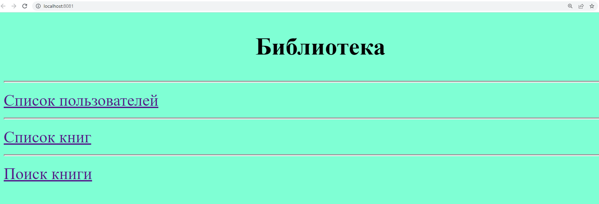

List of all readers:

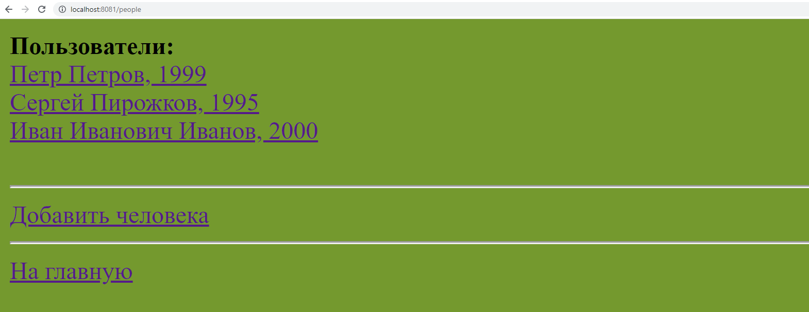

Create a new user:

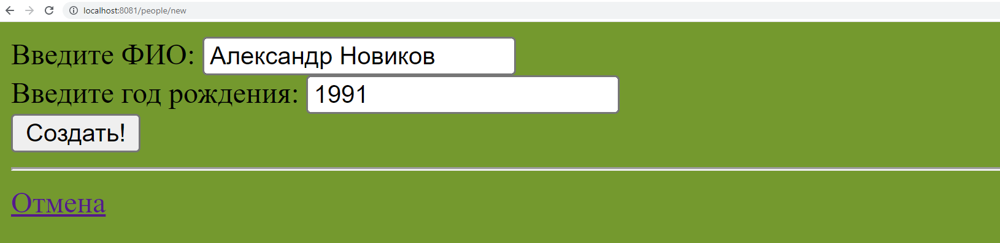

List of all books:

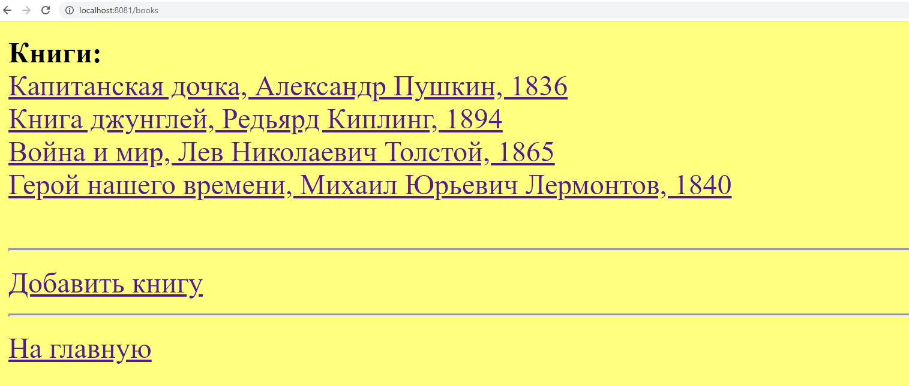

Create a new book:

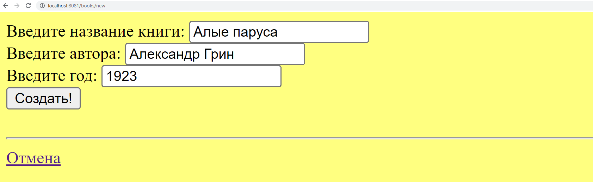

Assign book to user:

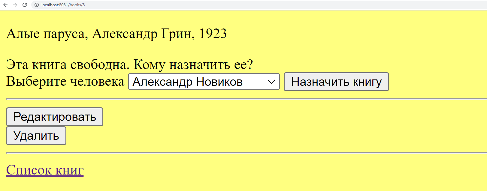

Viewing user information:

(
If the book is not returned within 10 days, it is highlighted in red.)

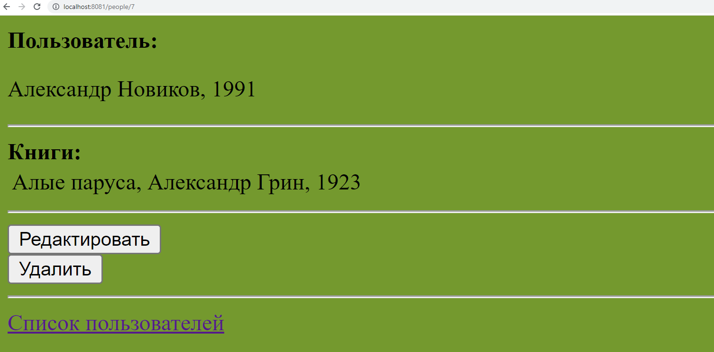

The administrator can search for a book.

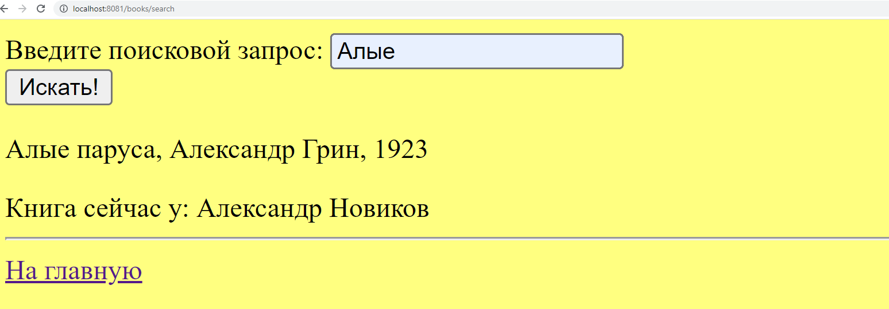

The project uses the following technologies:
1. **Spring** - creating a backend part of the application.
2. **HTML** -  creating a custom part of the application (frontend). 
3. **Thymeleaf** - allows to store html templates on the server side and issue them by calling a specific code.
4. **Docker** - for application deployment PostgreSQL, to work with the database, automatic initialization of the database.
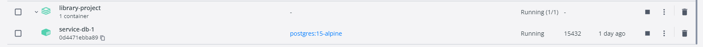
5. **Liquibase** - to track, manage, and enforce database schema changes.
6. **Tomcat** - used as a server to run our application.
7. **Validation** - to check the correctness of entering user data.

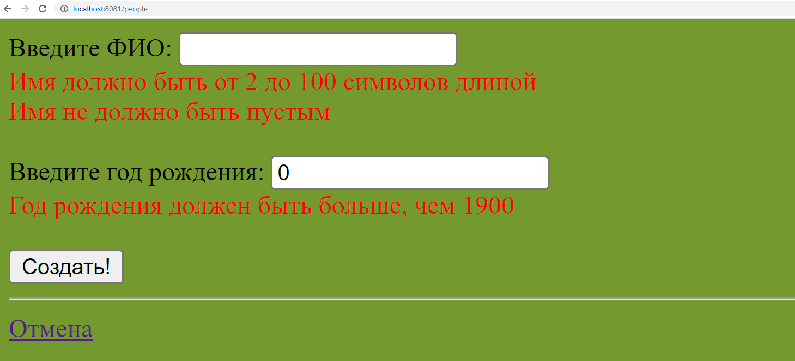

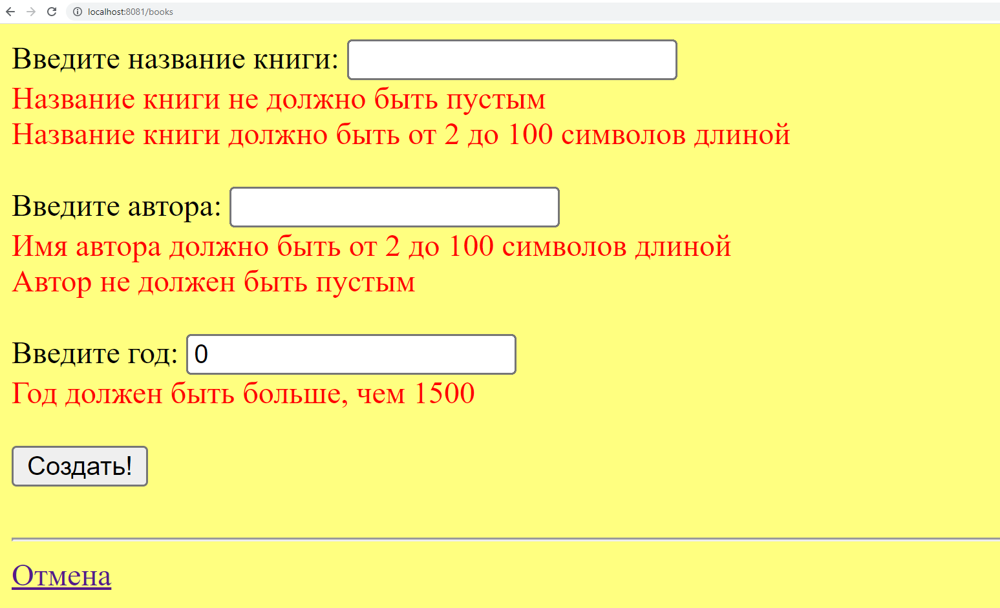